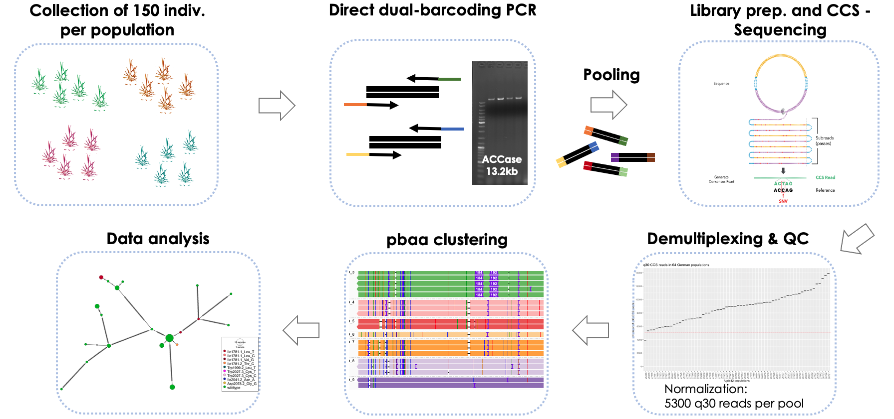
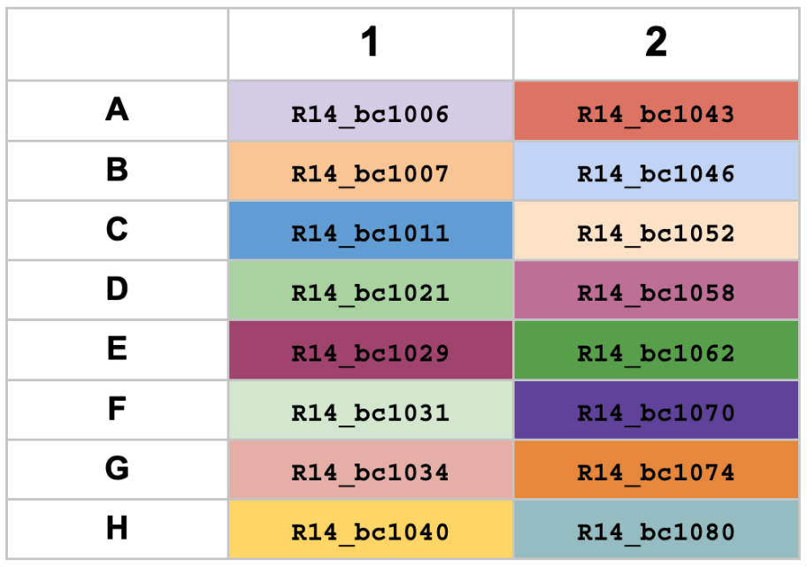
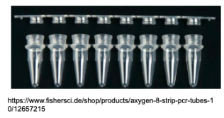
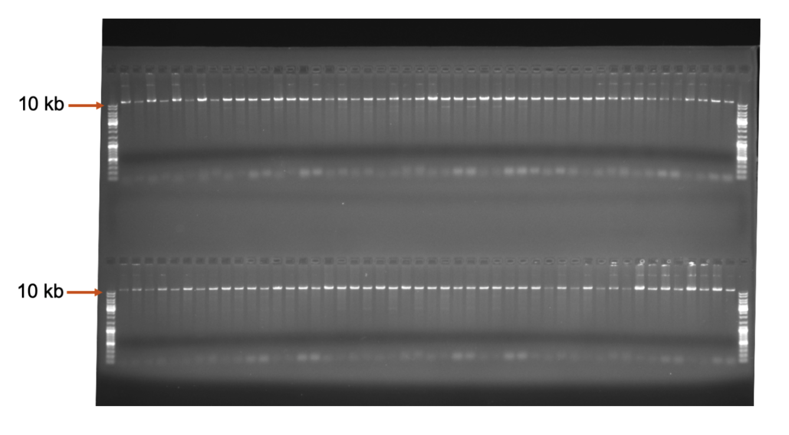

# ALOMY pools
# ACCase-amplicon protocol
This protocol generates ACCase-amplicon pool libraries with a direct barcoding approach from **200 ng input DNA (Conc. 10 ng/ul)** and can multiplex up to 384 samples (4 plates) by dual indexing for sequencing using the Sequel II system (Pacific Biosciences).

## Workflow

## Materials & Machines

**Materials:**

* Ethanol
* Elution buffer (EB)
* Beckman Coulter™ Agencourt AMPure XP (Fisher Scientific, Beckman Coulter™, A63881)
* PrimeSTAR® GXL DNA Polymerase (Takara, R050B)
* Qubit™ dsDNA HS Assay Kit (Thermo Scientific, Q32851)
* BluePippin cassettes for ACCase size selection: High-Pass Plus 0.75% Agarose for 15kb HP, includes reagents, 3 Cassettes (Biozym, 342BPLUS03)
* Wide orifice tips, 200 ul and 1000 ul (Thermo Scientific, 2069GPK and 2079GPK)
* Femto Pulse Genomic DNA 165 kb Kit (Agilent, FP-1002-0275)
* 8-strip PCR tubes, 2ml Eppendorf tubes and 96-well PCR plates
* Index-oligos (See appendix, oligos)

**Machines:**
* Qubit Fluorometer
* BluePippin (Sage Science)
* Femto Pulse System (Agilent)
* Magnetic stand for 2ml tubes
* Centrifuge for plates and Eppendorf tubes
* Thermocycler

## ACCase amplicons

## Indexing primer preparation

If you work with plates, it is recommended to prepare the indexing plates before starting the protocol. Note that for the plate indices, the reverse primer concentration is 5uM and the forward primer concentration is 1uM to facilitate automated pipetting with higher volumes.
With the attached 40 indexing oligos, 384 samples can be multiplexed (4 plates).
Please use the forward and reverse index-plates as following:

| Sample plate | Forward plate | Reverse column |
|--------------|---------------|----------------|
| Plate 1 | 1 | 1 |
| Plate 2 | 1 | 2 |
| Plate 4 | 2 | 1 |
| Plate 5 | 2 | 2 |

**Forward primer - Concentration: 1 uM**

| Reagent | for 100 ul |
|---------|------------|
| 100 uM Stock forward Oligo | 8.5 ul |
| water | 841.5 ul |
|----------------------------|------------|
| total | 850 ul |

Pipette 100 ul per well in a PCR plate.

### Plate Design:
**Forward - Plate 1**

**Forward - Plate 2**

**Reverse primer - Concentration: 5 uM**

| Reagent | for 100 ul |
|---------|------------|
| 100 uM Stock reverse Oligo | 5 ul |
| water | 95 ul |
|----------------------------|------------|
| total | 100 ul |

Pipette 100 ul per well in a PCR plate.

### Plate Design:
**Reverse**

## Protocol
### 1. ACCase PCR reaction
To generate a sufficient amount of ACCase amplicon libraries for our 64 pooled field populations, we set up 4 reactions per population. We found it more convenient to set them up on plates.

**Single sample assay:**
Prepared primers are in single tubes at 5 uM concentration.
PrimeSTAR® GXL DNA Polymerase (Takara, R050B).

| Reagent | 1x | Mastermix |
| --------|----|-----------|
| Normalized DNA (10 ng/ul) | 5 ul | - |
| Forward primer (5 uM) | 1 ul |   |
| Reverse primer (5 uM) | 1 ul |   |
| 5 x buffer | 4 ul |   |
| dNTPs | 1.6 ul |   |
| Prime STAR polymerase | 0.4 ul |   |
| water | 7.0 ul |   |
|-----------------------|--------|---------|
| total | 20 ul |   |

**96 - well plate assay:**

Use prepared indexing plates and add the reagents to a plate by following the order in the table below. We used an Viaflo 96 pipettor (Integra) for step 1 and 2, followed by a multichannel pipette for step 5 and 6.

| Reagent | 1x per well | Mastermix 96 |
|---------|-------------|--------------|
| **Step 1**: Add your **normalized DNA** (10 ng/ul) to every well. | 5 ul | |
| **Step 2**: Add **forward primer** (1 uM) to every well, (according to the indexing plate scheme) and store plate on ice. | 5 ul | |
| **Step 3**: Prepare a **mastermix** of the following 4 components in a 2 ml tube and mix it: | | |
| water | 3 ul | 339 ul | 
| 5 x buffer | 4 ul | 452 ul |
| dNTPs | 1.6 ul | 180.8 ul|
| Prime STAR polymerase | 0.4 ul | 45.2 ul |
| **Step 4**: Work on ice. Distribute 151.3 ul of this **mastermix** to every well of a clean 8-well PCR strip. Remember the orientation of the strip. |  | |
| **Step 5**: Choose one column of the reverse indexing plate. Use a multichannel and add  **13.8 ul reverse primer** of this chosen column to the mastermix in the 8-well PCR strip, close it, mix it and centrifuge it down. | | |
| **Step 6**: Use a multichannel pipette and distribute 12 ul of the **mastermix + reverse primer** from that 8-well PCR strip, column by column to your plate containing the DNA and the forward primers. Mix it, centrifuge it down and keep it on ice. Place it immediatly in the PCR machine. | | |

**Indexing PCR-program:**
| Step | Temperature | Duration | Cycles |
|------|-------------|----------|--------|
| Denaturation | 98 °C | 10 s | 28 |
| Annealing & Extension | 68 °C | 11 min | 28 |
| Final Extension | 72 °C | 10 min | 1 |
| Hold | 4 °C | ∞ | 1 |

Expected amount per library: 8-15 ng/ul.

Gel picture, ACCase-amplicons,13.2 kb length:

### 2. Pooling

At this step, all indexed amplicon pool libraries are combined into one single large pool. Therefore all libraries need to be measured with a Qubit and pooled in equal amounts. It can be done manually or with an automated system like a Tecan pipetting robot.

### 3.Bead-Cleanup

  **3.1.** If necessary split amplicon pools into several 2 ml tubes. Calculate with a conservative recovery of 50% and make sure that you will have a minimum of 2ug recovery from each tube in about 30 ul elution buffer for Blue Pippin size selection.

  **3.2.** Add AMPure XP magnetic beads in a 0.45:1 library:bead ratio to the tubes, mix it well by pipetting up and down with wide-orifice tips and give it 5 min incubation at RT to bind to the beads.

  **3.3.** Place on the magnetic stand for 5 min or until beads are bound to the side.

  **3.4.** Remove and discard supernatant, leaving tubes on the magnetic stand.

  **3.5.** Add 2 ml fresh 80% EtOH to wash the beads, while keeping the plate on the magnet, wait 30 s and remove and discard EtOH.

  **3.6.** Repeat the 80% EtOH wash and carefully remove all remaining EtOH. **Note: Sometimes it is good to flash spin and put the tubes back on the magnet and remove the last ul of EtOH with a pipet.**

  **3.7.** Let the beads dry for 2 min. **Note: Don’t overdry the beads as this can lead to substantial DNA losses.**

  **3.8.** Add 35 uL H2O and resuspend the beads by pipetting carefully.

  **3.9.** Incubate 5 min at room temperature.

  **3.10.** Place on a magnetic stand for 5 min or until beads are stuck to the side.

  **3.11.** Transfer 32 ul supernatant (containing the DNA) to a fresh tube.

### 4.Blue Pippin size selection with a 0.75% gel, 15kb - 50 kb and S1 external standards

Perform a size selection with Blue Pippin range: 10,000 - 50,000 bp, following Blue Pippin operations manual for High-Pass Plus 0.75% Agarose for 15kb, Art.-Nr.: 342BPLUS03 (BPLUS03): http://www.sagescience.com/wp-content/uploads/2015/07/High-Pass-User-Guide-for-BluePippin-SMRTbell-7_23_15_2.pdf

The S1 marker is loaded into a separate Blue Pippin well, which needs to be specified as a reference lane.

For our experiment, we loaded ~ 2ug DNA per well, in total 6 ug (don’t underload, as this decreases yield!).

**Note: We distributed our pooled amplicons to 3 Blue Pippin wells and washed the elution wells one more time with 40 ul elution buffer to maximize recovery.**

**Femto Pulse check before and after Blue Pippin:**

Before Blue Pippin:

LM = Lower marker

After Blue Pippin:

LM = Lower marker

### 5. Bead-Cleanup

  **5.1.** Pool all recovered amplicon libraries in a 2 ml tube. Add AMPure XP magnetic beads in a 1:1 library:bead ratio to the tube, mix it well by pipetting up and down with wide-orifice tips and give it 5 min incubation at RT to bind to the beads.

  **5.2.** Place on the magnetic stand for 5 min or until beads are bound to the side.

  **5.3.** Remove and discard supernatant, leaving tubes on the magnetic stand.

  **5.4.** Add 2 ml fresh 80% EtOH to wash the beads, while keeping the plate on the magnet, wait 30 s and remove and discard EtOH.

  **5.5.** Repeat the 80% EtOH wash and carefully remove all remaining EtOH. **Note: Sometimes it is good to flash spin and put the tubes back on the magnet and remove the last ul of EtOH with a pipet.**

  **5.6.** Let the beads dry for 2 min. **Note: Don’t overdry the beads as this can lead to substantial DNA losses.**

  **5.7.** Add 50 uL H2O and resuspend the beads by pipetting carefully.

  **5.8.** Incubate 5 min at room temperature.

  **5.9.** Place on a magnetic stand for 5 min or until beads are stuck to the side.

  **5.10.** Transfer 48 ul supernatant (containing the DNA) to a fresh tube.

### 6. PacBio library preparation and SMRT cell loading

Follow PacBio library recommendations and SMRT cell loading in the following protocol for amplicons of 12 kb size.

https://www.pacb.com/wp-content/uploads/Procedure-Checklist-Preparing-SMRTbell-Libraries-using-PacBio-Barcoded-Universal-Primers-for-Multiplexing-Amplicons.pdf (Part Number 101-791-800 Version 02 (April 2020))

https://www.pacb.com/wp-content/uploads/Quick-Reference-Card-Loading-and-Pre-Extension-Recommendations-for-the-Sequel-II-and-IIe-Systems.pdf (Part Number 101-769-100 Version 08 (July 2021))

## Appendix

### Oligos

**ACCase** Indexing oligos (Purification:Cartridge, biomers):

| Oligo name | Sequence |
|------------|----------|
| ACCase_R14_bc1006| 5’ CATATATATCAGCTGTGAATCACTCTCCCAAGACTAGAATTACAGG 3’ |
| ACCase_R14_bc1007| 5’ TCTGTATCTCTATGTGGAATCACTCTCCCAAGACTAGAATTACAGG 3’ |
| ACCase_R14_bc1011| 5’ CTATACGTATATCTATGAATCACTCTCCCAAGACTAGAATTACAGG 3’ |
| ACCase_R14_bc1021| 5’ CTATACATAGTGATGTGAATCACTCTCCCAAGACTAGAATTACAGG 3’ |
| ACCase_R14_bc1029| 5’ TATATATGTCTATAGAGAATCACTCTCCCAAGACTAGAATTACAGG 3’ |
| ACCase_R14_bc1031| 5’ GATGTCTGAGTGTGTGGAATCACTCTCCCAAGACTAGAATTACAGG 3’ |
| ACCase_R14_bc1034| 5’ ATGTGTATATAGATATGAATCACTCTCCCAAGACTAGAATTACAGG 3’ |
| ACCase_R14_bc1040| 5’ TGTCATATGAGAGTGTGAATCACTCTCCCAAGACTAGAATTACAGG 3’ |
| ACCase_R14_bc1043| 5’ TATAGAGCTCTACATAGAATCACTCTCCCAAGACTAGAATTACAGG 3’ |
| ACCase_R14_bc1046| 5’ GATATATCGAGTATATGAATCACTCTCCCAAGACTAGAATTACAGG 3’ |
| ACCase_R14_bc1052| 5’ GTGTGAGATATATATCGAATCACTCTCCCAAGACTAGAATTACAGG 3’ |
| ACCase_R14_bc1058| 5’ TGTGTCTCTGAGAGTAGAATCACTCTCCCAAGACTAGAATTACAGG 3’ |
| ACCase_R14_bc1062| 5’ TCTCAGATAGTCTATAGAATCACTCTCCCAAGACTAGAATTACAGG 3’ |
| ACCase_R14_bc1070| 5’ TGCTCTCGTGTACTGTGAATCACTCTCCCAAGACTAGAATTACAGG 3’ |
| ACCase_R14_bc1074| 5’ TGTACGCTCTCTATATGAATCACTCTCCCAAGACTAGAATTACAGG 3’ |
| ACCase_R14_bc1080| 5’ TATCTCTGTAGAGTCTGAATCACTCTCCCAAGACTAGAATTACAGG 3’ |
| ACCase_F11_bc1009| 5’ ACACACGCGAGACAGAGAGTTCGCCGTGGCATGCTTAGG 3’ |
| ACCase_F11_bc1016| 5’ CATAGAGAGATAGTATGAGTTCGCCGTGGCATGCTTAGG 3’ |
| ACCase_F11_bc1017| 5’ CACACGCGCGCTATATGAGTTCGCCGTGGCATGCTTAGG 3’ |
| ACCase_F11_bc1019| 5’ ACACACTCTATCAGATGAGTTCGCCGTGGCATGCTTAGG 3’ |
| ACCase_F11_bc1022| 5’ CACTCACGTGTGATATGAGTTCGCCGTGGCATGCTTAGG 3’ |
| ACCase_F11_bc1026| 5’ CACAGAGACACGCACAGAGTTCGCCGTGGCATGCTTAGG 3’ |
| ACCase_F11_bc1037| 5’ ACACATATCGCACTACGAGTTCGCCGTGGCATGCTTAGG 3’ |
| ACCase_F11_bc1039| 5’ CGCACACATAGATACAGAGTTCGCCGTGGCATGCTTAGG 3’ |
| ACCase_F11_bc1045| 5’ ACATATCGTACTCTCTGAGTTCGCCGTGGCATGCTTAGG 3’ |
| ACCase_F11_bc1047| 5’ TGTCATGTGTACACACGAGTTCGCCGTGGCATGCTTAGG 3’ |
| ACCase_F11_bc1048| 5’ GTGTGCACTCACACTCGAGTTCGCCGTGGCATGCTTAGG 3’ |
| ACCase_F11_bc1053| 5’ CTCACGTACGTCACACGAGTTCGCCGTGGCATGCTTAGG 3’ |
| ACCase_F11_bc1055| 5’ CACACGAGATCTCATCGAGTTCGCCGTGGCATGCTTAGG 3’ |
| ACCase_F11_bc1056| 5’ AGACACACACGCACATGAGTTCGCCGTGGCATGCTTAGG 3’ |
| ACCase_F11_bc1059| 5’ CACACGCACTGAGATAGAGTTCGCCGTGGCATGCTTAGG 3’ |
| ACCase_F11_bc1060| 5’ GATGAGTATAGACACAGAGTTCGCCGTGGCATGCTTAGG 3’ |
| ACCase_F11_bc1063| 5’ ACACGCATGACACACTGAGTTCGCCGTGGCATGCTTAGG 3’ |
| ACCase_F11_bc1064| 5’ TATATACAGAGTCGAGGAGTTCGCCGTGGCATGCTTAGG 3’ |
| ACCase_F11_bc1067| 5’ CTCTATATATCTCGTCGAGTTCGCCGTGGCATGCTTAGG 3’ |
| ACCase_F11_bc1068| 5’ AGAGAGCTCTCTCATCGAGTTCGCCGTGGCATGCTTAGG 3’ |
| ACCase_F11_bc1078| 5’ CTCACACATACACGTCGAGTTCGCCGTGGCATGCTTAGG 3’ |
| ACCase_F11_bc1083| 5’ ATATGACATACACGCAGAGTTCGCCGTGGCATGCTTAGG 3’ |
| ACCase_F11_bc1090| 5’ AGCACACATATAGCGCGAGTTCGCCGTGGCATGCTTAGG 3’ |
| ACCase_F11_bc1094| 5’ ATAGCGACATCTCTCTGAGTTCGCCGTGGCATGCTTAGG 3’ |
