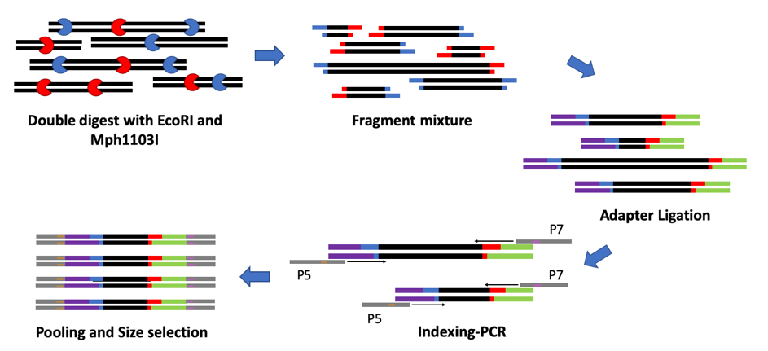
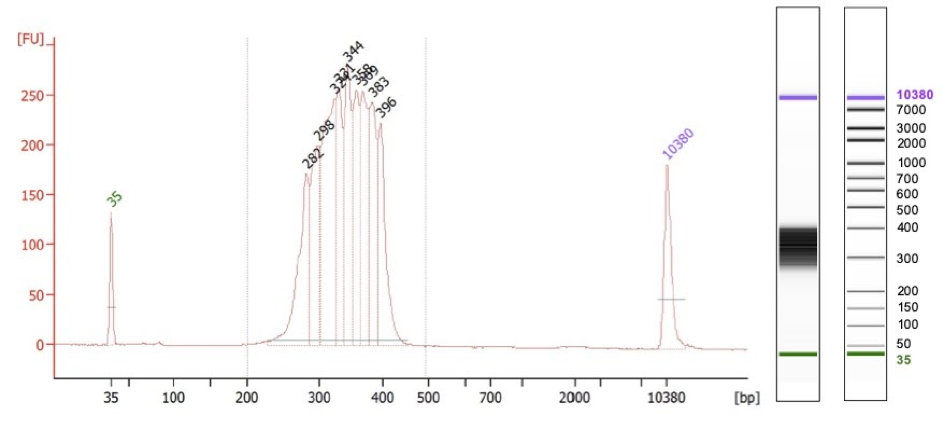
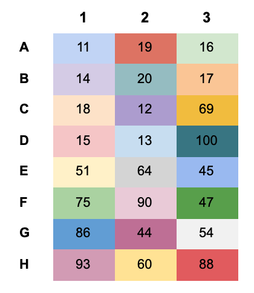
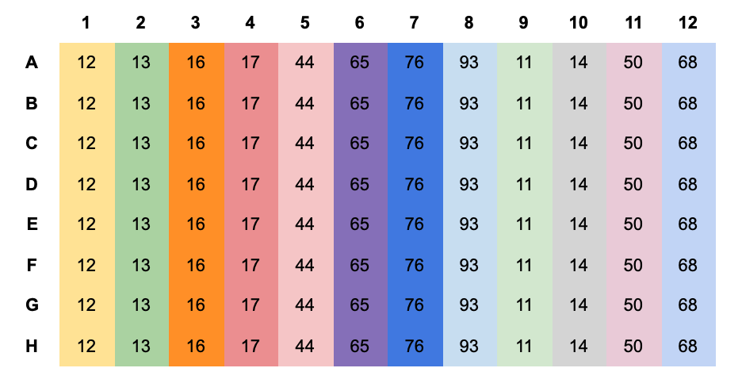
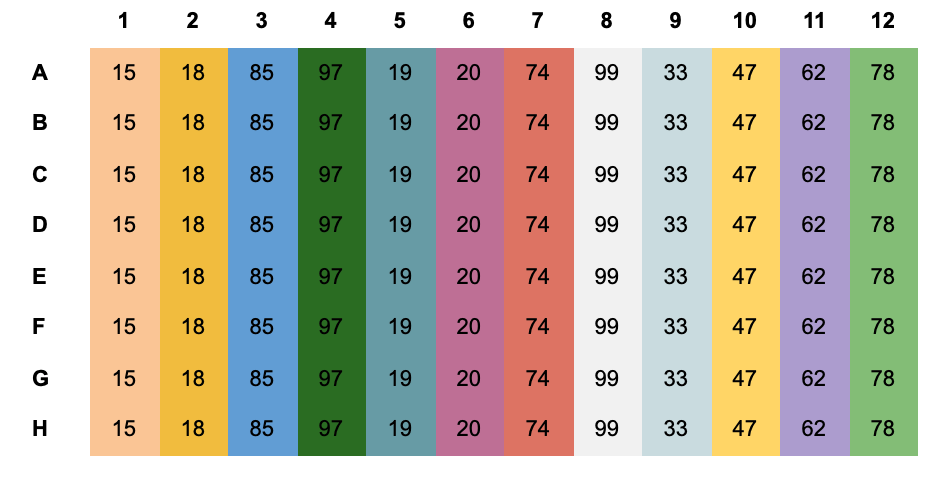

# ddRAD-library protocol

This protocol generates double-digest RAD libraries from **200 ng input DNA (10 ng/ul in 20 ul)** and can multiplex up to 576 samples (6 plates). It is recommended to perform an *in-silico* digest on your reference to determine the right combination of enzymes (e.g. with RestrictionDigest [Wang et al. 2016](https://www.sciencedirect.com/science/article/pii/S071734581630001X)).

*In-silico* digestion example for *Alopecurus myosuroides*:

**In numbers:** We are aiming for 111744 fragments, which represents 1.1% of the whole genome.

## Materials & Machines
**Materials:**
* FD Mph1103I (Thermo Scientific, **FD0734**)
* FD EcoRI (Thermo Scientfic, **FD0274**)
* T4 DNA Ligase (5 U/µL) (Thermo Scientific, **EL0011**)
* Tris HCl (1M, pH 8.0)
* EDTA
* NaCl (5M)
* Isopropanol
* Natriumacetate (3M)
* Magnetic beads
* Ethanol
* Elution buffer (EB)
* KAPA2G Robust PCR Kit (Sigma Aldrich, **KK5023**)
* Qubit™ dsDNA HS Assay Kit (Thermo Scientific, **Q32851**)
* EconoSpin columns (Epoch life science, **1920-050/250**)
* BluePippin 1.5% cassette
* Bioanalyzer HS chip
* Illumina Enhanced PCR Mix (EPM), leftover from TruSeq Nanokit
* Illumina PCR primer cocktail (PPC), leftover from TruSeq Nanokit
* Index- and adapter oligos (See appendix, oligos)

**Machines:**
* Qubit Fluorometer
* BluePippin (Sage Science)
* Bioanalyzer Instrument
* Magnetic stand
* Centrifuge for plates and Eppendorf tubes
* Thermo cycler

## Adapter preparation
It is recommended to prepare the hybridization buffer and the adapters before starting the protocol.
Since the restriction enzyme cutting sites of our fragments are the same, the sequencing signal would not be balanced right at the beginning. To overcome that, we have designed adapter pairs containing variable amounts (0-3) of additional bases to generate a shift. Therefore, samples combined in one Illumina lane should have adapters with all types of shifts (0-3) on both ends of the fragments. 
The sequences of the adapters for ordering can be found in the appendix, adapter oligos.

Hybridzation buffer (10X):
| Reagent | final conc. (10X) | for 100 ml (10X) |
|---------|-------------------|------------------|
| Tris HCl, pH 8.0 (1M) | 100 mM | 10 ml |
| NaCl (5M) | 500 mM | 10 ml |
| EDTA | 10 mM | 0.3722 g | 
| Water | -| 80 ml |

The buffer can be autoclaved for longer storage.

Use the adapter pair with the same shift:
| Enzyme | Oligo 1 | Oligo 2 |
|--------|---------|---------|
| EcoRI (0 shift) | G-43923 | G-43924 |
| EcoRI (1 shift) | G-44180 | G-44183 |
| EcoRI (2 shift) | G-44181 | G-44184 |
| EcoRI (3 shift) | G-44182 | G-44185 |
| Mph1103I (0 shift) | G-43925 | G-43926 |
| Mph1103I (1 shift) | G-44186 | G-44189 |
| Mph1103I (2 shift) | G-44187 | G-44190 |
| Mph1103I (3 shift) | G-44188 | G-44191 |

| Reagent | for 100 ul |
|---------|------------|
| 100 uM Stock Oligo 1 | 10 ul |
| 100 uM Stock Oligo 2 | 10 ul |
| 10X Hybridization buffer | 10 ul |
| Water | 70 ul |
|----------|----------|
| Total | 100 ul |

Pipet 25 ul per well in a PCR plate and run the hybridization program.

**Adapter hybrization PCR-program:**

**Step 1:** 97.5 °C for 2:30 min

**Step 2:** 97 °C for 30 s

Then go to Step 2, 1.5 °C decrement per 30s, 50 times 

**Step 3:** Hold at 15 °C

**Note:** After taking out the adapters from the machine, place them directly on ice and never leave the hybridized adapters at RT to avoid risk of dehybridization.

## Protocol
ddRAD-library scheme:

### 1. Digestion

| Reagent | 1x| Mastermix |
|---------|---|-----------|
| Normalized DNA (200 ng) | 20 ul | - |
| FD EcoRI | 0.5 ul | |
| FD Mph1103I | 0.5 ul | |
| FD buffer | 3.0 ul | |
| Water | 6.0 ul | |
|----------|----------|----------|
| Total | 30 ul | |

Incubate the reaction at 37 °C for 3 hours in a PCR machine.

### 2. Bead-Cleanup with Large Cutoff

  **2.1** Add 18 ul of SPRI beads to each well with the digestion reaction (1:0.6 ratio, digested DNA : beads), mix it well by pipetting up and down and give it 5 min incubation at RT to bind to the beads.
  
  **2.2** Pellet the beads with the plate magnet for 5 min and transfer 46 ul of the supernatant to a new well.
  
  **Note: Keep the supernatant!** The large fragments that we want to remove are bound to the beads and can be discarded.
  
  **2.3** Add 55.2 ul beads to the supernatant (from here on we bind and wash the remaining short fragments in the supernatant; 1:1.8 ratio , digested DNA : beads).  
  
  **Note:** The PEG in the bead buffer is critical to force the DNA to bind to the beads and it is still abundant in the supernatant from the first step, therefore it is sufficient to add only the difference between 1.8 - 0.6 = 1.2X amount of beads according to the transferred supernatant volume.
  
  **2.4** Pellet the beads with the plate magnet for 10 min and remove the supernatant.
  
  **2.5** Add 200 ul 80% Ethanol per well while keeping the plate on the plate magnet.
  
  **2.6** Remove the Ethanol and discard it. Repeat step 2.5. and 2.6. once.
  
  **2.7** Let the beads dry for 2 min. Note: Don’t overdry the beads as this can lead to substantial library losses.
  
  **2.8** Remove the plate from the magnet and add 23 ul of EB buffer. Mix very well by pipetting and let it incubate for 10 min in RT to elute from the beads.
  
  **2.9** Pellet the beads with the plate magnet for 5 min.
  
  **2.10** Transfer 20 ul supernatant to a new well.
  
### 3. Adapter ligation

| Reagent | 1x| Mastermix |
|---------|---|-----------|
| Digested and cleaned DNA | 20 ul |-|
| T4 DNA ligase | 1.0 ul | |
| T4 lig buffer 10x | 3.0 ul | |
| Adapter 1 - EcoRI * | 0.5 ul | |
| Adapter 2 - Mph1103I* | 0.5 ul |
| Water | 5.0 ul | |
|----------|----------|----------|
| Total | 30 ul | |

*Adapters must be hybridized, following the instructions of section Adapter preparation. Keep in mind to combine adapters with different shifts per HiSeq 3000 lane.

**Ligation PCR-program:**

**Step 1:** 23 °C for 30 min

**Step 2:** 65 °C for 10 min

**Step 3:** 2 °C decrement per 90s, 21 cycles

**Step 4:** Hold at 15 °C

### 4. Bead-Cleanup with Large Cutoff

  **4.1** Add 18 ul of SPRI beads to each well with the digestion reaction (1:0.6 ratio, digested DNA : beads), mix it well by pipetting up and down and give it 5 min incubation at RT to bind to the beads.
  
  **4.2** Pellet the beads with the plate magnet for 5 min and transfer 46 ul of the supernatant to a new well.
  
  **Note: Keep the supernatant!** The large fragments that we want to remove are bound to the beads and can be discarded.
  
  **4.3** Add 41.4 ul beads to the supernatant (from here on we bind and wash the remaining short fragments in the supernatant; 1:1.5 ratio , digested DNA : beads).
  
  **4.4** Pellet the beads with the plate magnet for 10 min and remove the supernatant.
  
  **4.5** Add 200 ul 80% Ethanol per well while keeping the plate on the plate magnet.
  
  **4.6** Remove the Ethanol and discard it. Repeat step 2.5. and 2.6. once.
  
  **4.7** Let the beads dry for 2 min. Note: Don’t overdry the beads as this can lead to substantial library losses.
  
  **4.8** Remove the plate from the magnet and add 23 ul of EB buffer. Mix very well by pipetting and let it incubate for 10 min in RT to elute from the beads.
  
  **4.9** Pellet the beads with the plate magnet for 5 min.
  
  **4.10** Transfer 20 ul supernatant to a new well.
  
### 5. Indexing PCR

With the attached 48 index oligos, 576 samples can be multiplexed (6 plates).
Please use the P5 and P7 index-plates as following with an 8-channel pipet:

| Sample plate | P7 plate | P5 column |
|--------------|----------|-----------|
| Plate 1 | 1 | 1 |
| Plate 2 | 1 | 2 |
| Plate 3 | 1 | 3 |
| Plate 4 | 2 | 1 |
| Plate 5 | 2 | 2 |
| Plate 6 | 2 | 3 |

| Reagent | 1x| Mastermix |
|---------|---|-----------|
| Adapter ligated and cleaned DNA | 10 ul | - |
| Primer P5 (10uM) | 1.25 ul | |
| Primer P7 (10uM) | 1.25 ul | |
| 10mM dNTPs | 0.5 ul | |
| Robust 2G Enzyme | 0.2 ul | |
| Robust Buffer A | 5 ul | |
| Water | 6.8 ul | |
|----------|----------|----------|
| Total | 25 ul

Indexing PCR-program:

| Step | Temperature | Duration | Cycles |
|------|-------------|----------|--------|
| Initial denaturation | 95 °C | 3 min | 1 |
| Denaturation | 95 °C | 15 s | 10 |
| Annealing | 60 °C | 15 s | 10 |
| Extension | 72 °C | 15 s | 10 |
| Final Extension | 72 °C | 1 min | 1 |
| Hold | 15 °C | ∞ | 1 |

Expected amount per library: 5-10 ng/ul.

### 6. Pooling

At this step, all indexed libraries will be pooled. There are two possibilities to proceed:

  1. Pooling based on measurements with a plate reader (e.g. with Pico Green).
  
  2. Equal pooling of a small fraction (2 ul) of each library and proceed from here through the complete protocol. Then the pool can be spiked into a HiSeq lane for ca. 5% and a calculation for the repooling can be done based on the amount of sequenced reads per library. This is the most accurate approach and provides excellent equal coverage for all samples. Caveat: Once you have calculated the real amount per library for pooling based on the spike-in, you will need to restart the protocol from here.

  Choose your pooling approach and pool all libraries. A total of 3 - 4 ug per pool is enough to run your samples in several lanes.
  
### 7. Column purification

Binding buffer: 

Note: Don’t mix the components of the binding buffer ahead!
 
| Reagent | |
|---------|-|
| Isopropanol | 8 parts |
| NaOAc (3M) | 1 parts |

All  following centfrifugation steps were conducted for 1 min and with a speed of 13000 rcf.

  **7.1** Calculate the parts for the binding buffer in the ratio 1:1 to your sample (e.g. 500 ul DNA + 500 ul binding buffer). Then add first the Isopropanol to your sample. Mix it with your DNA and then add the NaOAc.
  
  **7.2** Load everything on an EconoSpin column. Spin it. Remove flowthrough. If your volume is higher than 800 ul, repeat this step until you have everything bound to the column.
  
  **7.3** Continue with two Ethanol washes: Add 800 ul Ethanol and spin it. Remove flowthrough. Repeat it.
  
  **7.4** Another last empty spin to reduce Ethanol residuals.
  
  **7.5** Place the column in a new Eppendorf tube and add 40 ul preheated water (60 °C). Let it incubate for 2 min.
  
  **7.6** Second elution: Pipet the flowthrough again on the column and spin it.
  
  **7.7** Recovery per pool was 35 ul.
  
### 8. Blue Pippin size selection with a 1.5% gel and R2 internal standards

Perform a size selection with Blue Pippin range: 250 - 450 bp.

**Note:** Max-Planck Blue Pippin has a shift, therefore choose 300 - 500 bp on the machine.

### 9. Bioanalyzer and Qubit measurement

Perform a bioanalyzer with a HS chip and a Qubit HS concentration measurement.

Bioanalyzer example: Mean fragment size: 341 bp.

### 10. PCR for library pool efficiency control

| Reagent | 1x| Mastermix |
|---------|---|-----------|
| Pooled and size selected library | 1 ul | - |
| Illumina Enhanced PCR Mix (EPM) | 10 ul | |
| Illumina PCR primer cocktail (PPC) | 2.5 ul | |
| water | 11.5 ul | |
|----------|----------|----------|
| total | 25 ul | |

PCR-program:

| Step | Temperature | Duration | Cycles |
|------|-------------|----------|--------|
| Initial denaturation | 95 °C | 3 min | 1 |
| Denaturation | 98 °C | 20 s | 8 |
| Annealing | 60 °C | 15 s | 8 |
| Extension | 72 °C | 30 s | 8 |
| Final Extension | 72 °C | 5 min | 1 |
| Hold | 4 °C | ∞ | 1 |

Make a Qubit HS concentration measurement after PCR.

**Computation:**

We performed 8 cycles, therefore 2^8 = 256:

<Conc_before_PCR> * 256 = <expected_amount_with_100%_efficiency>

We have used a 25 ul assay:

<Conc_after_PCR> * 25 ul = <real_amount_with_given_efficiency>

Efficiency:
<real_amount_with_given_efficiency> / <expected_amount_with_100%_efficiency> * 100 = <efficiency_in_%>

We expect an efficiency of 100% for our libraries.
Submission for Sequencing
Note: Use RSB for library dilution!

Computation:

Formula: <Desired nM> * 660 * <mean_fragment_length> / 10^6

Normally we submit 2.5 nM for a HiSeq 3000 lane:

2.5 nM * 660 * <mean_fragment_length> / 106 = <desired_end_conc.>

The minimum volume for submission and qubit measurements is 13 ul:

(1.) <desired_end_conc.> * 13 ul = <overall_ng_to_submit>

(2.) <overall_ng_to_submit> / <library_pool_conc.> = <ul_of_library_pool_to_pipet>

(3.) 13 ul - <ul_of_library_pool_to_pipet> = <ul_of_resuspension_buffer>

Pipet rather a bit more of your library and make several control qubit measurements. You should hit the calculated <desired_end_conc.> for submission.

## Appendix
#### Oligos

Adapter oligos (Purification: HPLC):
| Oligo name | Sequence |
|------------|----------|
| G-43923 | 5’ ACACTCTTTCCCTACACGACGCTCTTCCGATCTG 3’ |
| G-44180 | 5’ ACACTCTTTCCCTACACGACGCTCTTCCGATCTCG 3’ |
| G-44181 | 5’ ACACTCTTTCCCTACACGACGCTCTTCCGATCTTCG 3’ |
| G-44182 | 5’ ACACTCTTTCCCTACACGACGCTCTTCCGATCTAGTG 3’ |
| G-43924 | 5’ Pho - AATTCAGATCGGAAGAGCGTCGTGTAGGGAAAGAGTGT 3’ |
| G-44183 | 5’ Pho - AATTCGAGATCGGAAGAGCGTCGTGTAGGGAAAGAGTGT 3’ |
| G-44184 | 5’ Pho - AATTCGAAGATCGGAAGAGCGTCGTGTAGGGAAAGAGTGT 3’ |
| G-44185 | 5’ Pho - AATTCACTAGATCGGAAGAGCGTCGTGTAGGGAAAGAGTGT 3’ |
| G-43925 | 5’ Pho - TAGATCGGAAGAGCACACGTCTGAACTCCAGTCAC 3’ |
| G-44186 | 5’ Pho - TGAGATCGGAAGAGCACACGTCTGAACTCCAGTCAC 3’ |
| G-44187 | 5’ Pho - TGCAGATCGGAAGAGCACACGTCTGAACTCCAGTCAC 3’ |
| G-44188 | 5’ Pho - TGCAAGATCGGAAGAGCACACGTCTGAACTCCAGTCAC 3’ |
| G-43926 | 5’ GTGACTGGAGTTCAGACGTGTGCTCTTCCGATCTATGC*A 3’ |
| G-44189 | 5’ GTGACTGGAGTTCAGACGTGTGCTCTTCCGATCTCATGC*A 3’ |
| G-44190 | 5’ GTGACTGGAGTTCAGACGTGTGCTCTTCCGATCTGCATGC*A 3’ |
| G-44191 | 5’ GTGACTGGAGTTCAGACGTGTGCTCTTCCGATCTTGCATGC*A 3’ |

* PTO

Indexing oligos (Purification: RP1, Sigma Aldrich):
| Oligo name | Sequence |
|------------|----------|
| P5_Tue_8nt_0011 | 5’ AATGATACGGCGACCACCGAGATCTACACtggttcttACACTCTTTCCCTACACGACGC 3’ |
| P5_Tue_8nt_0012 | 5’ AATGATACGGCGACCACCGAGATCTACACgtcttcttACACTCTTTCCCTACACGACGC 3’ |
| P5_Tue_8nt_0013 | 5’ AATGATACGGCGACCACCGAGATCTACACccattcttACACTCTTTCCCTACACGACGC 3’ |
| P5_Tue_8nt_0014 | 5’ AATGATACGGCGACCACCGAGATCTACACatctcattACACTCTTTCCCTACACGACGC 3’ |
| P5_Tue_8nt_0015 | 5’ AATGATACGGCGACCACCGAGATCTACACtgattggtACACTCTTTCCCTACACGACGC 3’ |
| P5_Tue_8nt_0016 | 5’ AATGATACGGCGACCACCGAGATCTACACggtctggtACACTCTTTCCCTACACGACGC 3’ |
| P5_Tue_8nt_0017 | 5’ AATGATACGGCGACCACCGAGATCTACACgtaatggtACACTCTTTCCCTACACGACGC 3’ |
| P5_Tue_8nt_0018 | 5’ AATGATACGGCGACCACCGAGATCTACACccgaaggtACACTCTTTCCCTACACGACGC 3’ |
| P5_Tue_8nt_0019 | 5’ AATGATACGGCGACCACCGAGATCTACACccaagagtACACTCTTTCCCTACACGACGC 3’ |
| P5_Tue_8nt_0020 | 5’ AATGATACGGCGACCACCGAGATCTACACgctcttctACACTCTTTCCCTACACGACGC 3’ |
| P5_Tue_8nt_0044 | 5’ AATGATACGGCGACCACCGAGATCTACACaactctcgACACTCTTTCCCTACACGACGC 3’ |
| P5_Tue_8nt_0045 | 5’ AATGATACGGCGACCACCGAGATCTACACatcgaacgACACTCTTTCCCTACACGACGC 3’ |
| P5_Tue_8nt_0047 | 5’ AATGATACGGCGACCACCGAGATCTACACtaagttagACACTCTTTCCCTACACGACGC 3’ |
| P5_Tue_8nt_0051 | 5’ AATGATACGGCGACCACCGAGATCTACACcctaccagACACTCTTTCCCTACACGACGC 3’ |
| P5_Tue_8nt_0054 | 5’ AATGATACGGCGACCACCGAGATCTACACacctcttcACACTCTTTCCCTACACGACGC 3’ |
| P5_Tue_8nt_0060 | 5’ AATGATACGGCGACCACCGAGATCTACACccagttccACACTCTTTCCCTACACGACGC 3’ |
| P5_Tue_8nt_0064 | 5’ AATGATACGGCGACCACCGAGATCTACACtggctaccACACTCTTTCCCTACACGACGC 3’ |
| P5_Tue_8nt_0069 | 5’ AATGATACGGCGACCACCGAGATCTACACccgaatacACACTCTTTCCCTACACGACGC 3’ |
| P5_Tue_8nt_0075 | 5’ AATGATACGGCGACCACCGAGATCTACACccagcaacACACTCTTTCCCTACACGACGC 3’ |
| P5_Tue_8nt_0086 | 5’ AATGATACGGCGACCACCGAGATCTACACacctatcaACACTCTTTCCCTACACGACGC 3’ |
| P5_Tue_8nt_0088 | 5’ AATGATACGGCGACCACCGAGATCTACACggtccgcaACACTCTTTCCCTACACGACGC 3’ |
| P5_Tue_8nt_0090 | 5’ AATGATACGGCGACCACCGAGATCTACACcatctccaACACTCTTTCCCTACACGACGC 3’ |
| P5_Tue_8nt_0093 | 5’ AATGATACGGCGACCACCGAGATCTACACgaatctaaACACTCTTTCCCTACACGACGC 3’ |
| P5_Tue_8nt_0100 | 5’ AATGATACGGCGACCACCGAGATCTACACccaggcaaACACTCTTTCCCTACACGACGC 3’ |
| P7_Tue_8nt_0011 | 5’ CAAGCAGAAGACGGCATACGAGATtggttcttGTGACTGGAGTTCAGACGTGTGC 3’ |
| P7_Tue_8nt_0012 | 5’ CAAGCAGAAGACGGCATACGAGATattctcttGTGACTGGAGTTCAGACGTGTGC 3’ |
| P7_Tue_8nt_0013 | 5’ CAAGCAGAAGACGGCATACGAGATcatggattGTGACTGGAGTTCAGACGTGTGC 3’ |
| P7_Tue_8nt_0014 | 5’ CAAGCAGAAGACGGCATACGAGATatcttggtGTGACTGGAGTTCAGACGTGTGC 3’ |
| P7_Tue_8nt_0015 | 5’ CAAGCAGAAGACGGCATACGAGATggtctggtGTGACTGGAGTTCAGACGTGTGC 3’ |
| P7_Tue_8nt_0016 | 5’ CAAGCAGAAGACGGCATACGAGATaagttcgtGTGACTGGAGTTCAGACGTGTGC 3’ |
| P7_Tue_8nt_0017 | 5’ CAAGCAGAAGACGGCATACGAGATtactaagtGTGACTGGAGTTCAGACGTGTGC 3’ |
| P7_Tue_8nt_0018 | 5’ CAAGCAGAAGACGGCATACGAGATccggttctGTGACTGGAGTTCAGACGTGTGC 3’ |
| P7_Tue_8nt_0019 | 5’ CAAGCAGAAGACGGCATACGAGATcttattctGTGACTGGAGTTCAGACGTGTGC 3’ |
| P7_Tue_8nt_0020 | 5’ CAAGCAGAAGACGGCATACGAGATcgttctctGTGACTGGAGTTCAGACGTGTGC 3’ |
| P7_Tue_8nt_0033 | 5’ CAAGCAGAAGACGGCATACGAGATaggtatggGTGACTGGAGTTCAGACGTGTGC 3’ |
| P7_Tue_8nt_0044 | 5’ CAAGCAGAAGACGGCATACGAGATgccgtccgGTGACTGGAGTTCAGACGTGTGC 3’ |
| P7_Tue_8nt_0047 | 5’ CAAGCAGAAGACGGCATACGAGATcttgatagGTGACTGGAGTTCAGACGTGTGC 3’ |
| P7_Tue_8nt_0050 | 5’ CAAGCAGAAGACGGCATACGAGATtaacgaagGTGACTGGAGTTCAGACGTGTGC 3’ |
| P7_Tue_8nt_0062 | 5’ CAAGCAGAAGACGGCATACGAGATataccgccGTGACTGGAGTTCAGACGTGTGC 3’ |
| P7_Tue_8nt_0065 | 5’ CAAGCAGAAGACGGCATACGAGATcaactaccGTGACTGGAGTTCAGACGTGTGC 3’ |
| P7_Tue_8nt_0068 | 5’ CAAGCAGAAGACGGCATACGAGATtcgagtacGTGACTGGAGTTCAGACGTGTGC 3’ |
| P7_Tue_8nt_0074 | 5’ CAAGCAGAAGACGGCATACGAGATgcctgaacGTGACTGGAGTTCAGACGTGTGC 3’ |
| P7_Tue_8nt_0076 | 5’ CAAGCAGAAGACGGCATACGAGATgttgcaacGTGACTGGAGTTCAGACGTGTGC 3’ |
| P7_Tue_8nt_0078 | 5’ CAAGCAGAAGACGGCATACGAGATgcagattaGTGACTGGAGTTCAGACGTGTGC 3’ |
| P7_Tue_8nt_0085 | 5’ CAAGCAGAAGACGGCATACGAGATtgcgtccaGTGACTGGAGTTCAGACGTGTGC 3’ |
| P7_Tue_8nt_0093 | 5’ CAAGCAGAAGACGGCATACGAGATagaagtaaGTGACTGGAGTTCAGACGTGTGC 3’ |
| P7_Tue_8nt_0097 | 5’ CAAGCAGAAGACGGCATACGAGATctagtcaaGTGACTGGAGTTCAGACGTGTGC 3’ |
| P7_Tue_8nt_0099 | 5’ CAAGCAGAAGACGGCATACGAGATtctgccaaGTGACTGGAGTTCAGACGTGTGC 3’ |

Indexing oligos plate design:

The above indexes are ordered by bases. If you take for example only indexes 11-20,  indexing bases would not be balanced, because all your indexes would start with an A. That’s why the indexing plate design is not ordered by numbers, but makes sure that in all columns (P5) or rows (P7) the indexing bases are equally distributed. This gives you the possibility to take only one or two columns of P5 or only one P7 plate without having to worry about generating an indexing bias.

P5 - Plate 1:

P7 - Plate 1:

P7 - Plate 2:

The combinations of all indexes are listed in a separate excel sheet which can be used to generate a submission file for demultiplexing.